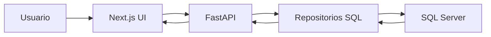
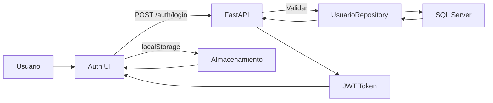
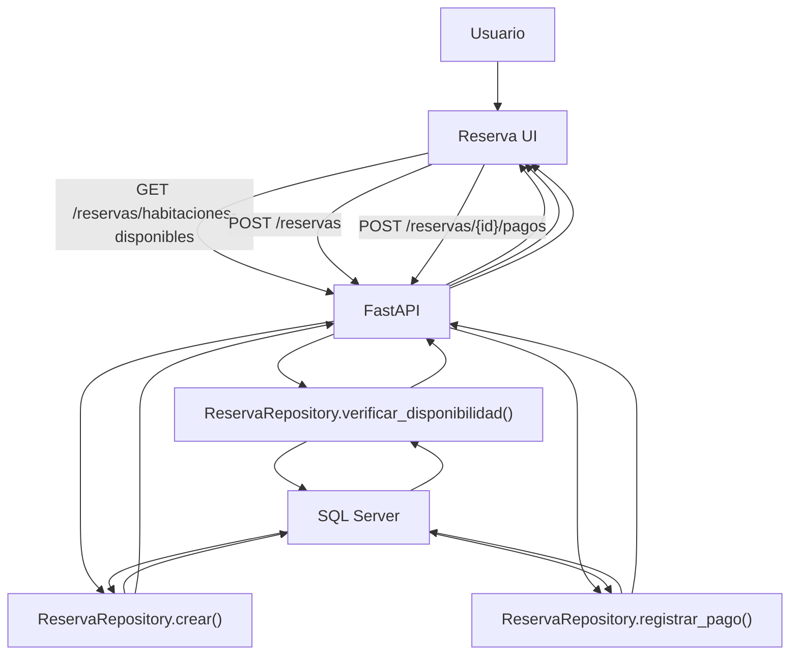
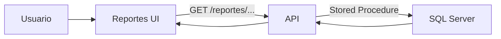
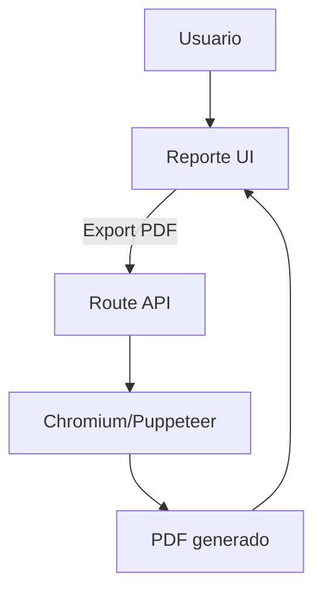
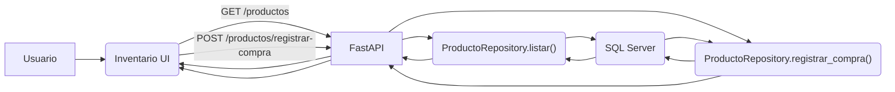
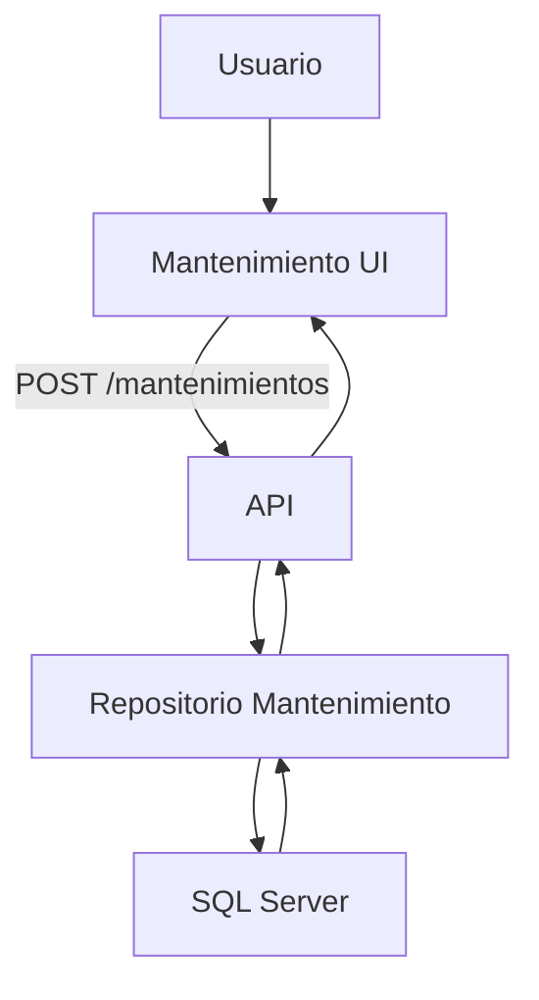
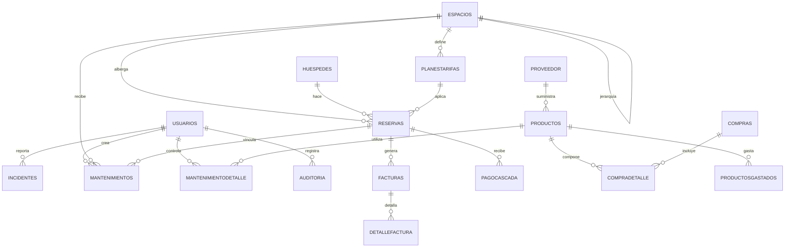

# Manual Técnico - Sistema de Gestión Hotelera

## 1. Portada

### Proyecto
Sistema de Gestión Hotelera

### Descripción general
Aplicación web para la gestión operativa de un hotel, con módulos de reservas, huéspedes, espacios, mantenimientos, inventarios, productos, proveedores y reportes.

El sistema combina:
- Backend Python con FastAPI.
- Frontend React/Next.js con App Router.
- Base de datos SQL Server.
- Generación de PDF desde el frontend.

### Tecnologías principales
- FastAPI
- Python 3.10+
- Pydantic
- pymssql
- Next.js
- TypeScript
- Tailwind CSS
- SQL Server
- Puppeteer / Chromium
- JWT y bcrypt

---

## 2. Introducción

Este manual técnico describe la solución real contenida en el repositorio, sus componentes, flujos de datos, contrato de API y recomendaciones de mejora.

El documento está dirigido a desarrolladores, arquitectos, operadores y analistas que necesiten:
- Comprender el diseño actual.
- Instalar y ejecutar la solución.
- Conocer la estructura de datos y los endpoints.
- Identificar áreas incompletas o riesgos.

Incluye detalles de:
- Arquitectura de software.
- Estructura del repositorio.
- Flujos de negocio.
- Modelos y tablas.
- Endpoints y documentación de API.
- Seguridad y diagnóstico.

---

## 3. Arquitectura y estructura del sistema

### 3.1 Arquitectura general
El sistema se organiza en un esquema cliente-servidor con separación clara entre:
- Aplicación frontend: UI y consumo de API.
- API backend: lógica de negocio y acceso a datos.
- Base de datos: almacenamiento relacional en SQL Server.

#### Flujo de interacción
1. El usuario navega la aplicación Next.js.
2. El frontend realiza peticiones HTTP contra FastAPI.
3. El backend valida, protege y procesa la petición.
4. Los repositorios ejecutan consultas o stored procedures en SQL Server.
5. El backend devuelve JSON.
6. El frontend muestra resultados, listas y formularios.

### 3.2 Componentes backend
- `app/main.py`
  - Inicializa FastAPI.
  - Configura CORS con `allow_origins=["*"]`.
  - Añade `AuthMiddleware` para proteger rutas de reservas.
  - Incluye routers: auth, reservas, reportes, huespedes, espacios, mantenimientos, proveedores y productos.

- `app/database.py`
  - Carga variables de entorno desde `app/.env`.
  - Expone `get_db()` que crea la conexión `pymssql` y la cierra después de usarla.
  - Verifica variables de configuración obligatorias y falla si faltan.

- `app/utils/security.py`
  - Define `SECRET_KEY`, `ALGORITHM`, `ACCESS_TOKEN_EXPIRE_MINUTES`.
  - Implementa hashing bcrypt y verificación de contraseñas.
  - Genera y decodifica JWT.
  - Provee `get_current_user()` como dependencia de FastAPI.

- `app/middleware/auth.py`
  - Middleware de Starlette que intercepta peticiones a `/reservas`.
  - Valida `Authorization: Bearer <token>`.
  - Decodifica JWT y consulta usuario en la base de datos.
  - Rechaza peticiones sin token, inválidas o expiradas.

- `app/repositories/base.py`
  - Clase base para repositorios.
  - Ejecuta consultas y stored procedures con `cursor.execute()`.
  - Controla `commit()` en escrituras y hace `rollback()` en caso de error.
  - Retorna `fetchall()` o `fetchone()` según el caso.

### 3.3 Componentes frontend
- `gestion-hotelera/app/` contiene páginas de la interfaz.
- `gestion-hotelera/components/` incluye componentes reutilizables como `NewReservation`, `Modal` y `TablePagination`.
- `gestion-hotelera/functions/http-base.ts` construye peticiones HTTP y agrega token desde `localStorage`.
- `gestion-hotelera/functions/auth.ts` maneja `login`, `signup`, `logout` y el usuario conectado.
- `gestion-hotelera/functions/reservas.ts` implementa llamadas de reserva y hooks de datos.
- `gestion-hotelera/functions/reportes-api.ts` implementa consumo de reportes.
- `gestion-hotelera/app/api/reservas-pdf/generate/route.ts` genera PDFs usando Chromium.

### 3.4 Organización del repositorio

Raíz:
- `README.md`
- `MANUAL_TECNICO.md`
- `app/` → backend
- `gestion-hotelera/` → frontend

Backend:
- `app/main.py`
- `app/database.py`
- `app/routes/`
- `app/repositories/`
- `app/models/`
- `app/middleware/`
- `app/utils/`

Frontend:
- `gestion-hotelera/package.json`
- `gestion-hotelera/app/`
- `gestion-hotelera/components/`
- `gestion-hotelera/functions/`
- `gestion-hotelera/data/`

---

## 4. Instalación y requerimientos

### 4.1 Requisitos mínimos

- Python 3.10 o superior.
- Node.js 20 o superior.
- pnpm.
- SQL Server accesible.
- Git.

### 4.2 Instalación del backend

```powershell
cd app
python -m venv .venv
.\.venv\Scripts\Activate.ps1
python -m pip install --upgrade pip
pip install -r requirements.txt
pip install python-dotenv
pip install python-jose[cryptography]
```

### 4.3 Variables de entorno del backend

Crear `app/.env` con:

```env
DB_SERVER=localhost
DB_PORT=1433
DB_USER=sa
DB_PASSWORD=TuPassword123
DB_NAME=DB20242000327
JWT_SECRET_KEY=UnaClaveMuySegura
JWT_ACCESS_TOKEN_EXPIRE_MINUTES=480
```

> Nota: `app/database.py` usa `dotenv` para cargar este archivo.

### 4.4 Instalación del frontend

```powershell
cd gestion-hotelera
pnpm install
Copy-Item .\env.local.example .\env.local
```

En Bash:

```bash
cd gestion-hotelera
pnpm install
cp env.local.example .env.local
```

### 4.5 Configuración adicional

- `gestion-hotelera/env.local.example` define `NEXT_PUBLIC_API_URL=http://localhost:8000`.
- El frontend también puede usar una constante `API_BASE_URL` en `functions/http-base.ts` y `functions/reservas.ts`.
- Asegurarse de tener `chrome.exe` disponible en Windows para la generación de PDF local.

### 4.6 Base de datos

El backend asume que la base de datos y los stored procedures ya existen.
No hay migraciones automáticas en el repositorio salvo la creación de `dbo.usuarios` en el constructor de `UsuarioRepository`.

---

## 5. Ejecución

### 5.1 Ejecutar el backend

Desde `app`:

```powershell
fastapi dev
```

O con uvicorn:

```powershell
uvicorn app.main:app --reload --host 0.0.0.0 --port 8000
```

### 5.2 Ejecutar el frontend

Desde `gestion-hotelera`:

```powershell
pnpm dev
```

### 5.3 Verificación rápida

- Frontend: `http://localhost:3000`
- Backend: `http://localhost:8000`
- Documentación de FastAPI: `http://localhost:8000/docs`

### 5.4 Pruebas básicas

- `curl http://localhost:8000/` debe devolver `{"Hello":"World"}`.
- `GET /reservas/habitaciones-disponibles` con parámetros de fechas.
- `POST /auth/login` y `POST /auth/signup`.

---

## 6. Mapas de módulos

### 6.1 Backend

#### Rutas y roles
- `app/routes/auth.py`
  - `POST /auth/signup`
  - `POST /auth/login`
- `app/routes/reservas.py`
  - `GET /reservas`
  - `GET /reservas/habitaciones-disponibles`
  - `GET /reservas/habitacion-disponible`
  - `GET /reservas/{reserva_id}`
  - `POST /reservas`
  - `POST /reservas/{reserva_id}/pagos`
- `app/routes/huespedes.py`
  - `GET /huespedes`
  - `GET /huespedes/{huesped_id}`
  - `POST /huespedes`
- `app/routes/espacios.py`
  - `GET /espacios/habitaciones`
  - `GET /espacios/{espacio_id}`
- `app/routes/productos.py`
  - `GET /productos`
  - `POST /productos/registrar-compra`
- `app/routes/proveedor.py`
  - `GET /proveedores/listar`
- `app/routes/reportes.py`
  - `GET /reportes`
  - `GET /reportes/clientes`
  - `GET /reportes/reservaciones-diarias`
  - `GET /reportes/estado-de-habitaciones`
  - `GET /reportes/actividades-mantenimientos-diarias`
  - `GET /reportes/pagos-realizados`
  - `GET /reportes/consumo-stock-semanal`
  - `GET /reportes/estadistica-ocupacion-mensual`
  - `GET /reportes/ingresos-tipo-habitacion`
  - `GET /reportes/consumo-amenidades-mensual`
  - `GET /reportes/incidentes`
- `app/routes/mantenimientos.py`
  - `GET /mantenimientos/` devolviendo placeholder.

#### Repositorios
- `app/repositories/base.py`
  - Ejecuta consultas SQL.
  - Maneja commits y rollbacks.
- `app/repositories/reserva.py`
  - `listar()`
  - `verificar_disponibilidad()`
  - `verificar_disponibilidad_unica()`
  - `obtener_por_id()`
  - `crear()`
  - `registrar_pago()`
- `app/repositories/usuario.py`
  - Crea tabla `dbo.usuarios` si no existe.
  - Inserta usuarios.
  - Busca usuario por email.
- `app/repositories/huesped.py`
  - Lista, obtiene, crea, actualiza y elimina huéspedes usando stored procedures.
- `app/repositories/espacio.py`
  - Devuelve habitaciones desde vistas.
  - Puede crear un espacio con INSERT directo.
- `app/repositories/producto.py`
  - Lista productos con parámetro opcional `proveedor_id`.
  - Registra compra enviando JSON a SQL Server.

#### Modelos
- `app/models/reserva.py`
  - `ReservaSchema`
  - `Reservas`
- `app/models/usuario.py`
  - `UsuarioSchema`
  - `UsuarioCreateSchema`
  - `UsuarioLoginSchema`
  - `UsuarioOutSchema`
- `app/models/huesped.py`
- `app/models/compra.py`
  - `CompraCreateSchema`

### 6.2 Frontend

#### Páginas principales
- `gestion-hotelera/app/page.tsx`: landing page y formulario principal de reserva.
- `gestion-hotelera/app/auth/page.tsx`: login y registro.
- `gestion-hotelera/app/bd/`: panel de administración con reportes y control de inventario.

#### Servicios
- `gestion-hotelera/functions/http-base.ts`
  - Construcción de URL base.
  - Agrega `Authorization` si existe token.
  - Maneja query params.
- `gestion-hotelera/functions/auth.ts`
  - `login()` y `signup()`.
  - `logout()`.
  - `getCurrentUser()` y `getAccessToken()`.
- `gestion-hotelera/functions/reservas.ts`
  - `getReserva()`.
  - `registrarPago()`.
  - `getReservas()`.
  - `getHabitacionesDisponibles()`.
  - `crearReserva()`.
  - Hooks `useReservas()` y `useHabitacionesDisponibles()`.
- `gestion-hotelera/functions/productos.ts`
  - `getProductos()`.
  - `registrarCompra()`.
- `gestion-hotelera/functions/reportes-api.ts`
  - `getClientesFrecuentes()`.
  - `getReservacionesDiarias()`.
  - `getEstadoHabitaciones()`.
  - `getActividadesMantenimiento()`.
  - `getPagosRealizados()`.
  - `getConsumoStockSemanal()`.
  - `getOcupacionMensual()`.
  - `getIngresosTipoHabitacion()`.
  - `getConsumoAmenidadesMensual()`.
  - `getIncidentes()`.

#### PDF
- `gestion-hotelera/app/api/reservas-pdf/generate/route.ts`
  - Genera PDF con Puppeteer/Core.
  - Usa Chromium local en desarrollo y `@sparticuz/chromium` en producción.
  - Define encabezado y pie de página.

---

## 7. Diagramas de flujo

### 7.1 Arquitectura general

El sistema se organiza en capas:
- Presentación: Next.js renderiza UI y formularios.
- Servicios: funciones TypeScript consumen APIs REST.
- Backend: FastAPI valida, aplica middleware y llama a repositorios.
- Datos: SQL Server almacena datos en tablas, vistas y stored procedures.

Flujo general:
1. El usuario interactúa con la aplicación en el navegador.
2. El frontend envía solicitudes HTTP al backend.
3. FastAPI recibe la petición, aplica middleware y dependencias.
4. El backend delega en repositorios la ejecución SQL.
5. SQL Server devuelve filas o resultados computados.
6. El backend convierte resultados a JSON y responde al frontend.
7. El frontend actualiza la interfaz con los datos recibidos.



### 7.2 Flujo HTTP genérico

- Frontend invoca `fetchAPI()` desde `functions/http-base.ts`.
- `fetchAPI()` construye la URL con `NEXT_PUBLIC_API_URL` y agrega headers.
- Si existe `hotel_token`, se incluye en `Authorization: Bearer <token>`.
- FastAPI recibe la petición y la enruta según el router correspondiente.
- Las rutas pueden usar dependencias Pydantic para validar body/query.
- El router pasa datos al repositorio y devuelve JSON o error.

```mermaid
flowchart TD
  Frontend -->|fetchAPI()| HTTP_Request("HTTP Request")
  HTTP_Request -->|Authorization| FastAPI
  FastAPI -->|Router| Handler("Route Handler")
  Handler -->|Validate| Validator("Pydantic")
  Handler --> Repo("Repository")
  Repo --> DB("SQL Server")
  DB --> Repo
  Repo --> Handler
  Handler --> FastAPI
  FastAPI --> Frontend
```

### 7.3 Flujo de autenticación

1. El usuario ingresa credenciales en `gestion-hotelera/app/auth/page.tsx`.
2. El frontend llama a `login()` en `gestion-hotelera/functions/auth.ts`.
3. `login()` envía `POST /auth/login` con `email` y `password`.
4. FastAPI valida el payload con `UsuarioLoginSchema`.
5. El backend consulta `UsuarioRepository.obtener_por_email()`.
6. Si el usuario existe, verifica `password_hash` con bcrypt.
7. Si la contraseña coincide, se crea JWT con `create_access_token()`.
8. El backend devuelve `access_token` y tipo de token.
9. El frontend guarda el token en `localStorage` bajo `hotel_token`.
10. Peticiones subsecuentes incluyen el token y pasan por `AuthMiddleware` en rutas protegidas.

> Nota: `AuthMiddleware` actualmente protege `/reservas`, pero no todas las rutas administrativas.



### 7.4 Flujo de creación de reserva

1. El usuario abre la página de reserva en el frontend.
2. El formulario solicita fechas de entrada y salida.
3. El frontend llama a `getHabitacionesDisponibles()` para `GET /reservas/habitaciones-disponibles`.
4. FastAPI recibe la petición y valida query params.
5. `ReservaRepository.verificar_disponibilidad()` ejecuta `sp_mostrar_habitaciones_disponibles`.
6. SQL Server retorna habitaciones libres para el rango especificado.
7. El frontend muestra las opciones disponibles.
8. El usuario completa datos de huésped y selecciona espacio.
9. Se envía `POST /reservas` con el payload de reserva.
10. FastAPI valida el body con `ReservaSchema` y dispara `ReservaRepository.crear()`.
11. `sp_crear_reserva` inserta la reserva y devuelve el resultado.
12. El backend responde con la reserva creada.
13. Si se registra pago, el frontend hace `POST /reservas/{reserva_id}/pagos?metodo=x&monto=y`.
14. `ReservaRepository.registrar_pago()` ejecuta `sp_registrar_pago`.
15. El backend confirma el pago y actualiza el estado de la reserva si corresponde.



### 7.5 Flujo de reportes y PDF

#### Reportes
1. El usuario solicita un reporte desde la UI de administración.
2. El frontend invoca funciones específicas en `gestion-hotelera/functions/reportes-api.ts`.
3. Cada función hace `GET /reportes/...` al backend.
4. FastAPI ejecuta stored procedures correspondientes, por ejemplo `sp_clientes_frecuentes`.
5. La base de datos devuelve filas agregadas o resumidas.
6. El frontend muestra tablas, gráficos o widgets de reporte.



#### Generación de PDF
1. El usuario accede a una página de reporte para exportar PDF.
2. El frontend llama a la ruta `gestion-hotelera/app/api/reservas-pdf/generate/route.ts`.
3. El route handler genera HTML y lanza Puppeteer/Chromium.
4. Chromium renderiza el contenido en modo headless.
5. Se produce el PDF y se devuelve al navegador para descargar.



### 7.6 Flujo de inventario y compras

1. El usuario navega al módulo de inventario.
2. El frontend solicita productos con `GET /productos`.
3. FastAPI valida el query param opcional `proveedor_id`.
4. `ProductoRepository.listar()` ejecuta `sp_listar_productos`.
5. SQL Server retorna el conjunto de productos.
6. El frontend muestra el inventario.
7. Para registrar un ingreso de compra, el frontend envía `POST /productos/registrar-compra`.
8. El body incluye `proveedor_id`, `numero_factura_proveedor`, `fecha_compra` y `detalles`.
9. `ProductoRepository.registrar_compra()` convierte `detalles` a JSON y llama a `crear_compra_json`.
10. SQL Server inserta `Compras` y `CompraDetalle` en una transacción.
11. El backend confirma la operación y el frontend actualiza la vista.



### 7.7 Flujo de mantenimiento

1. El usuario accede al módulo de mantenimiento desde la UI.
2. El frontend hace la petición a la ruta de mantenimientos.
3. Actualmente, `app/routes/mantenimientos.py` devuelve un placeholder en lugar de lógica completa.
4. El backend debería validar los datos y llamar a un repositorio de mantenimiento.
5. En el futuro, el flujo esperado es:
   - `POST /mantenimientos` para crear solicitudes.
   - `GET /mantenimientos` para listar tareas.
   - `POST /mantenimientos/{id}/detalle` para registrar materiales y mano de obra.
6. El repositorio usaría `Mantenimientos` y `MantenimientoDetalle` para persistir datos.



---

## 8. Flujos en general de los módulos

### 8.1 Reservas

- `GET /reservas`: lista reservas, opcional `fecha_entrada`.
- `GET /reservas/habitaciones-disponibles`.
- `GET /reservas/habitacion-disponible`.
- `GET /reservas/{reserva_id}`.
- `POST /reservas`.
- `POST /reservas/{reserva_id}/pagos`.

### 8.2 Autenticación

- `POST /auth/signup` crea usuario y token.
- `POST /auth/login` emite token.
- El token se usa en `Authorization: Bearer <token>`.

### 8.3 Huéspedes

- `GET /huespedes`.
- `GET /huespedes/{huesped_id}`.
- `POST /huespedes`.
- El repository usa `sp_listar_huespedes`, `sp_obtener_huesped`, `sp_crear_huesped`, `sp_actualizar_huesped`, `sp_eliminar_huesped`.

### 8.4 Espacios

- `GET /espacios/habitaciones` filtrable por `disponibles_only`.
- `GET /espacios/{espacio_id}`.
- El repository usa `vw_habitaciones` y `vw_reporte_habitaciones`.

### 8.5 Productos

- `GET /productos` permite `proveedor_id`.
- `POST /productos/registrar-compra`.
- En el frontend, el payload incluye `proveedor_id`, `numero_factura_proveedor`, `fecha_compra` y `detalles`.

### 8.6 Proveedores

- `GET /proveedores/listar`.
- Usa `sp_listar_proveedores`.

### 8.7 Reportes

- `GET /reportes/clientes`.
- `GET /reportes/reservaciones-diarias`.
- `GET /reportes/estado-de-habitaciones`.
- `GET /reportes/actividades-mantenimientos-diarias`.
- `GET /reportes/pagos-realizados`.
- `GET /reportes/consumo-stock-semanal`.
- `GET /reportes/estadistica-ocupacion-mensual`.
- `GET /reportes/ingresos-tipo-habitacion`.
- `GET /reportes/consumo-amenidades-mensual`.
- `GET /reportes/incidentes`.

---

## 9. Tablas y modelos de datos

### 9.1 Modelos Pydantic

#### `ReservaSchema`
- `reserva_id: Optional[int] = None`
- `huesped_id: Optional[int] = None`
- `nombres: Optional[str] = None`
- `apellidos: Optional[str] = None`
- `telefono: Optional[str] = None`
- `email: Optional[str] = None`
- `dni: Optional[str] = None`
- `espacio_id: Optional[int] = None`
- `numero_reserva: Optional[str] = None`
- `numero_espacio: Optional[str] = None`
- `numero_huespedes: Optional[int] = None`
- `fecha_entrada: Optional[str] = None`
- `fecha_salida: Optional[str] = None`
- `cantidad_unidades: Optional[int] = None`
- `reserva_estado: Optional[str] = None`
- `tarifa: Optional[float] = None`

Este modelo admite reservas con datos de huésped embebidos y campos opcionales para número y estado de reserva.

#### `Reservas`
- `huesped_id: str`
- `espacio_id: str`
- `tarifa_id: str`
- `numero_reserva: str`
- `estado: str`
- `fecha_entrada: str`
- `fecha_salida: str`
- `cantidad_unidades: str`
- `precio_unidades: str`
- `total_pagar: str`
- `fecha_creacion: str`

Este modelo representa una reserva listada con valores completos en forma de cadena.

#### `UsuarioSchema`
- `usuario_id: Optional[int] = None`
- `primer_nombre: str`
- `segundo_nombre: str`
- `primer_apellido: str`
- `segundo_apellido: str`
- `fecha_nacimiento: date`
- `email: EmailStr`
- `password_hash: str`
- `created_at: Optional[datetime] = None`

#### `UsuarioCreateSchema`
- `primer_nombre: str`
- `segundo_nombre: str`
- `primer_apellido: str`
- `segundo_apellido: str`
- `fecha_nacimiento: date`
- `email: EmailStr`
- `password: str`

#### `UsuarioLoginSchema`
- `email: EmailStr`
- `password: str`

#### `UsuarioOutSchema`
- `usuario_id: int`
- `primer_nombre: str`
- `segundo_nombre: str`
- `primer_apellido: str`
- `segundo_apellido: str`
- `fecha_nacimiento: date`
- `email: EmailStr`

#### `DetalleCompraSchema`
- `producto_id: int`
- `cantidad: int`
- `costo_unitario: float`

#### `CompraCreateSchema`
- `proveedor_id: int`
- `numero_factura_proveedor: str`
- `fecha_compra: datetime`
- `detalles: List[DetalleCompraSchema]`

#### `Huesped`
- `nombres: str`
- `apellidos: str`
- `telefono: str`
- `email: str`
- `dni: str`

#### `Espacio`
- `numero_espacio: str`
- `categoria: str`
- `tipo: str`
- `estado: str`
- `espacio_padre_id: str`
- `estado_activo: bool`
- `capacidad_huespedes: int`

#### `Productos`
- `proveedor_id: str`
- `categoria: str`
- `nombre: str`
- `precio: str`
- `cantidad: str`
- `unidad: str`
- `fecha_vencimiento: str`
- `estado_activo: str`

> Nota: `app/models/mantenimiento.py` existe como archivo vacío, por lo que no hay un modelo Pydantic definido para mantenimientos en el backend.

### 9.2 Tablas principales

#### `Auditoria`
- `auditoria_id` int IDENTITY(1,1) PK
- `usuario_id` int NOT NULL
- `tabla_afectada` varchar(50) NULL
- `accion` varchar(100) NOT NULL
- `descripcion` varchar(200) NOT NULL
- `valores_antiguos` nvarchar(max) NULL
- `valores_nuevos` nvarchar(max) NULL
- `fecha_accion` datetime2(0) NULL DEFAULT getdate()

#### `CompraDetalle`
- `compra_detalle_id` int IDENTITY(1,1) PK
- `compra_id` int NOT NULL
- `producto_id` int NOT NULL
- `cantidad` int NOT NULL
- `costo_unitario` decimal(12,2) NOT NULL

#### `Compras`
- `compra_id` int IDENTITY(1,1) PK
- `proveedor_id` int NOT NULL
- `numero_factura_proveedor` varchar(50) NOT NULL
- `fecha_compra` datetime2(0) NOT NULL

#### `DetalleFactura`
- `detalle_factura_id` int IDENTITY(1,1) PK
- `factura_id` int NOT NULL
- `descripcion` varchar(200) NOT NULL
- `cantidad` int NOT NULL DEFAULT 1
- `precio_unitario` decimal(10,2) NOT NULL
- `porcentaje_iva` decimal(5,2) NOT NULL DEFAULT 15.00
- `total` computed AS ((cantidad * precio_unitario) * (1 + porcentaje_iva / 100))

#### `Espacios`
- `espacio_id` int IDENTITY(1,1) PK
- `numero_espacio` varchar(20) NOT NULL UNIQUE
- `categoria` varchar(20) NOT NULL CHECK (categoria IN ('Bodega','Cuarto','Habitacion','Piso','Edificio','Hotel'))
- `tipo` varchar(20) NOT NULL
- `estado` varchar(20) NOT NULL CHECK (estado IN ('Limpieza','Mantenimiento','Ocupado','Disponible','Funcional'))
- `espacio_padre_id` int NULL
- `estado_activo` bit NULL DEFAULT 1
- `capacidad_huespedes` int NULL DEFAULT 2

#### `Facturas`
- `factura_id` int IDENTITY(1,1) PK
- `reserva_id` int NOT NULL
- `numero_factura` varchar(20) NOT NULL UNIQUE
- `nombre_cliente` varchar(60) NOT NULL
- `dni_cliente` varchar(20) NOT NULL
- `metodo_pago` varchar(20) NOT NULL DEFAULT 'Efectivo'
- `fecha_emision` datetime2(0) NULL DEFAULT getdate()
- `saldo_restante` decimal(10,2) NULL
- `estado` varchar(20) NOT NULL DEFAULT 'Pendiente' CHECK (estado IN ('Anulada','Pago completo','Pago parcial','Pendiente'))

#### `Huespedes`
- `huesped_id` int IDENTITY(1,1) PK
- `nombres` varchar(50) NOT NULL
- `apellidos` varchar(50) NOT NULL
- `telefono` varchar(20) NOT NULL
- `email` varchar(100) NULL
- `puntos_lealtad` int NULL DEFAULT 0
- `estado_activo` bit NULL DEFAULT 1
- `dni` varchar(20) NOT NULL UNIQUE DEFAULT ''

#### `Incidentes`
- `incidente_id` int IDENTITY(1,1) PK
- `usuario_id` int NOT NULL
- `tipo` varchar(100) NULL
- `detalles` varchar(2500) NOT NULL
- `causas` varchar(1000) NULL
- `recomendaciones` varchar(1000) NULL
- `fecha` datetime2(7) NOT NULL

#### `MantenimientoDetalle`
- `mantenimiento_detalle_id` int IDENTITY(1,1) PK
- `mantenimiento_id` int NOT NULL
- `producto_id` int NULL
- `cantidad` int NULL DEFAULT 0
- `descripcion` varchar(200) NOT NULL
- `subtotal` decimal(12,2) NULL DEFAULT 0.00
- `mano_obra` decimal(12,2) NULL DEFAULT 0.00

#### `Mantenimientos`
- `mantenimiento_id` int IDENTITY(1,1) PK
- `espacio_id` int NOT NULL
- `usuario_id` int NOT NULL
- `responsable_id` int NULL
- `nombre_responsable` varchar(50) NULL
- `telefono_responsable` varchar(20) NULL
- `tipo` varchar(20) NOT NULL
- `prioridad` varchar(30) NOT NULL CHECK (prioridad IN ('Baja','Media','Alta','Urgente'))
- `estado` varchar(20) NOT NULL CHECK (estado IN ('En Proceso','Cancelado','Finalizado','Pendiente'))
- `fecha_inicio` datetime2(0) NOT NULL
- `fecha_final` datetime2(0) NULL

#### `PagoCascada`
- `pago_id` int IDENTITY(1,1) PK
- `monto` decimal(10,2) NOT NULL
- `metodo` varchar(20) NOT NULL DEFAULT 'Efectivo' CHECK (metodo IN ('Transferencia','Deposito','Efectivo'))
- `fecha_pago` datetime2(0) NOT NULL DEFAULT getdate()
- `reserva_id` int NOT NULL

#### `PlanesTarifas`
- `tarifa_id` int IDENTITY(1,1) PK
- `espacio_id` int NOT NULL
- `tipo_cobro` varchar(20) NOT NULL CHECK (tipo_cobro IN ('Mes','Noche','Hora'))
- `precio_unidad` decimal(10,2) NOT NULL
- `descripcion` varchar(100) NULL

#### `Productos`
- `producto_id` int IDENTITY(1,1) PK
- `proveedor_id` int NOT NULL
- `categoria` varchar(50) NOT NULL
- `nombre` varchar(50) NOT NULL
- `precio` decimal(10,2) NOT NULL DEFAULT 0.00
- `cantidad` int NULL
- `unidad` varchar(20) NOT NULL
- `fecha_vencimiento` date NOT NULL
- `estado_activo` bit NULL DEFAULT 1

#### `ProductosGastados`
- `producto_gastado_id` int IDENTITY(1,1) PK
- `producto_id` int NOT NULL
- `cantidad` int NULL DEFAULT 0
- `fecha` date NOT NULL DEFAULT getdate()

#### `Proveedor`
- `proveedor_id` int IDENTITY(1,1) PK
- `nombre` varchar(200) NOT NULL UNIQUE
- `rtn` varchar(20) NOT NULL UNIQUE
- `categoria` varchar(40) NOT NULL CHECK (categoria IN ('Papeleria','Blanqueria','Mantenimiento Tecnico','Alimentacion','Limpieza'))
- `telefono` varchar(20) NOT NULL
- `email` varchar(100) NULL

#### `Reservas`
- `reserva_id` int IDENTITY(1,1) PK
- `huesped_id` int NOT NULL
- `espacio_id` int NOT NULL
- `tarifa_id` int NOT NULL
- `numero_reserva` varchar(30) NOT NULL UNIQUE
- `estado` varchar(255) NOT NULL CHECK (estado IN ('Finalizada','Cancelada','Hospedado','No asistio','Rechazada','Reservada','Pendiente'))
- `fecha_entrada` datetime2(0) NOT NULL
- `fecha_salida` datetime2(0) NOT NULL
- `cantidad_unidades` int NOT NULL
- `precio_unidad` decimal(12,2) NOT NULL
- `total_pagar` computed AS (cantidad_unidades * precio_unidad)
- `fecha_creacion` datetime2(0) NOT NULL DEFAULT getdate()

#### `Usuarios`
- `usuario_id` int IDENTITY(1,1) PK
- `primer_nombre` varchar(20) NOT NULL
- `segundo_nombre` varchar(20) NOT NULL
- `primer_apellido` varchar(20) NOT NULL
- `segundo_apellido` varchar(20) NOT NULL
- `fecha_nacimiento` date NOT NULL
- `telefono` varchar(20) NULL
- `email` varchar(100) NOT NULL UNIQUE
- `rol` varchar(50) NULL CHECK (rol IN ('Mantenimiento','Administrador','Limpieza','Recepcionista'))
- `password_hash` varchar(255) NULL
- `estado_activo` bit NULL DEFAULT 1
- `fecha_modificacion_password` date NULL
- `fecha_contrato` date NOT NULL DEFAULT getdate()
- `estado` varchar(20) NULL DEFAULT 'Disponible'

### 9.3 Observaciones de modelado

- El repositorio `HuespedRepository` usa SPs con parámetros de nombre y apellido, pero el esquema del frontend puede ser más amplio.
- `ReservaSchema` admite datos de huésped dentro de la misma reserva, lo que indica que la entidad huésped se provisiona implícitamente.
- El backend no define todos los campos de `Reserva` que el frontend envía, por lo que hay un desajuste de contrato.

---

## 10. Esquema de base de datos

### 10.1 Relaciones principales

- `Auditoria.usuario_id` → `Usuarios.usuario_id`
- `CompraDetalle.compra_id` → `Compras.compra_id`
- `CompraDetalle.producto_id` → `Productos.producto_id`
- `Compras.proveedor_id` → `Proveedor.proveedor_id`
- `DetalleFactura.factura_id` → `Facturas.factura_id`
- `Espacios.espacio_padre_id` → `Espacios.espacio_id`
- `Facturas.reserva_id` → `Reservas.reserva_id`
- `Incidentes.usuario_id` → `Usuarios.usuario_id`
- `MantenimientoDetalle.mantenimiento_id` → `Mantenimientos.mantenimiento_id`
- `MantenimientoDetalle.producto_id` → `Productos.producto_id`
- `Mantenimientos.espacio_id` → `Espacios.espacio_id`
- `Mantenimientos.usuario_id` → `Usuarios.usuario_id`
- `Mantenimientos.responsable_id` → `Usuarios.usuario_id`
- `PagoCascada.reserva_id` → `Reservas.reserva_id`
- `PlanesTarifas.espacio_id` → `Espacios.espacio_id`
- `Productos.proveedor_id` → `Proveedor.proveedor_id`
- `ProductosGastados.producto_id` → `Productos.producto_id`
- `Reservas.espacio_id` → `Espacios.espacio_id`
- `Reservas.huesped_id` → `Huespedes.huesped_id`
- `Reservas.tarifa_id` → `PlanesTarifas.tarifa_id`

### 10.2 Claves principales

| Entidad | Clave | Comentario |
|---|---|---|
| Usuarios | usuario_id | PK auto incremental |
| Huespedes | huesped_id | PK auto incremental |
| Espacios | espacio_id | PK auto incremental |
| Reservas | reserva_id | PK auto incremental |
| Productos | producto_id | PK auto incremental |
| Compras | compra_id | PK auto incremental |
| CompraDetalle | compra_detalle_id | PK auto incremental |
| Mantenimientos | mantenimiento_id | PK auto incremental |
| MantenimientoDetalle | mantenimiento_detalle_id | PK auto incremental |
| Incidentes | incidente_id | PK auto incremental |
| Facturas | factura_id | PK auto incremental |
| Proveedor | proveedor_id | PK auto incremental |
| PlanesTarifas | tarifa_id | PK auto incremental |
| PagoCascada | pago_id | PK auto incremental |
| ProductosGastados | producto_gastado_id | PK auto incremental |
| Auditoria | auditoria_id | PK auto incremental |
| Compras | compra_id | PK auto incremental |

### 10.3 Claves foráneas

| Origen | Campo | Destino |
|---|---|---|
| Auditoria | usuario_id | Usuarios.usuario_id |
| CompraDetalle | compra_id | Compras.compra_id |
| CompraDetalle | producto_id | Productos.producto_id |
| Compras | proveedor_id | Proveedor.proveedor_id |
| DetalleFactura | factura_id | Facturas.factura_id |
| Espacios | espacio_padre_id | Espacios.espacio_id |
| Facturas | reserva_id | Reservas.reserva_id |
| Incidentes | usuario_id | Usuarios.usuario_id |
| MantenimientoDetalle | mantenimiento_id | Mantenimientos.mantenimiento_id |
| MantenimientoDetalle | producto_id | Productos.producto_id |
| Mantenimientos | espacio_id | Espacios.espacio_id |
| Mantenimientos | usuario_id | Usuarios.usuario_id |
| Mantenimientos | responsable_id | Usuarios.usuario_id |
| PagoCascada | reserva_id | Reservas.reserva_id |
| PlanesTarifas | espacio_id | Espacios.espacio_id |
| Productos | proveedor_id | Proveedor.proveedor_id |
| ProductosGastados | producto_id | Productos.producto_id |
| Reservas | espacio_id | Espacios.espacio_id |
| Reservas | huesped_id | Huespedes.huesped_id |
| Reservas | tarifa_id | PlanesTarifas.tarifa_id |

### 10.4 Diagrama ER conceptual



### 10.5 Integridad referencial

- El repositorio necesita que la base de datos ya tenga las tablas y SP definidos.
- La única tabla creada automáticamente en el código es `dbo.usuarios`.
- Recomendación: usar un sistema de migraciones para mantener la versión del esquema.

---

## 11. Procesos almacenados

### 11.1 Stored procedures usados

| Procedimiento | Uso |
|---|---|
| sp_listar_huespedes | Listar huéspedes |
| sp_obtener_huesped | Obtener un huésped por ID |
| sp_crear_huesped | Crear un huésped |
| sp_actualizar_huesped | Actualizar un huésped |
| sp_eliminar_huesped | Eliminar un huésped |
| sp_listar_productos | Listar productos |
| sp_mostrar_habitaciones_disponibles | Consultar disponibilidad |
| sp_mostrar_habitacion_disponible | Consulta de disponibilidad por tipo |
| sp_obtener_reserva | Obtener reserva por ID |
| sp_crear_reserva | Crear reserva |
| sp_registrar_pago | Registrar pago |
| sp_listar_proveedores | Listar proveedores |
| sp_clientes_frecuentes | Generar reporte de clientes |
| sp_reporte_reservaciones_diarias | Reporte de reservas por día |
| sp_reporte_actividades_mantenimiento | Reporte de mantenimiento |
| sp_listar_pagos_realizados | Reporte de pagos |
| sp_consumo_stock_semanal | Reporte de consumo de stock |
| sp_estadistica_ocupacion_habitacion_mensual | Ocupación mensual |
| sp_ingresos_por_tipo_habitacion | Ingresos por tipo |
| sp_resumen_mensual_consumo_productos | Consumo mensual de productos |
| sp_incidentes | Reporte de incidentes |
| crear_compra_json | Registrar compra con detalle JSON |

### 11.2 Mapeo de uso

- `ReservaRepository.crear()` envía 8 parámetros a `sp_crear_reserva`.
- `ReservaRepository.registrar_pago()` pasa `reserva_id`, `metodo` y `monto`.
- `ProductoRepository.registrar_compra()` convierte una lista de detalles en JSON y llama a `crear_compra_json`.
- `ReportesRouter` ejecuta SP directamente con `cursor.execute()`.
- Algunos SPs reciben fechas como parámetros `date` desde FastAPI.

### 11.3 Observaciones

- No hay documentación de firma exacta dentro del código.
- El backend confía en los nombres de SP y la estructura de los parámetros.
- Es recomendable versionar estos SPs y documentar cada parámetro en SQL.

---

## 12. Vistas

### 12.1 Vistas detectadas

- `vw_habitaciones`
- `vw_reporte_habitaciones`

### 12.2 Uso en el backend

- `EspacioRepository.obtener_habitaciones()` usa `vw_reporte_habitaciones` para filtrado de disponibles y `vw_habitaciones` para todas las habitaciones.
- `EspacioRepository.obtener_por_id()` consulta `vw_habitaciones`.

### 12.3 Recomendación

- Documentar el esquema de estas vistas en SQL.
- Asegurar que las vistas contienen campos consistentes con los modelos TypeScript usados en el frontend.

---

## 13. Endpoints API

### 13.1 Autenticación

| Método | Ruta | Autenticación | Descripción |
|---|---|---|---|
| POST | /auth/signup | No | Crea usuario y devuelve token |
| POST | /auth/login | No | Inicia sesión y devuelve token |

### 13.2 Reservas

| Método | Ruta | Auth | Descripción |
|---|---|---|---|
| GET | /reservas | Sí | Lista reservas, opcional `fecha_entrada` |
| GET | /reservas/habitaciones-disponibles | Sí | Habitaciones disponibles entre fechas |
| GET | /reservas/habitacion-disponible | Sí | Habitaciones disponibles por tipo |
| GET | /reservas/{reserva_id} | Sí | Detalle de reserva |
| POST | /reservas | Sí | Crea reserva |
| POST | /reservas/{reserva_id}/pagos | Sí | Registra pago |

### 13.3 Huéspedes

| Método | Ruta | Auth | Descripción |
|---|---|---|---|
| GET | /huespedes | No | Lista huéspedes |
| GET | /huespedes/{huesped_id} | No | Detalle de huésped |
| POST | /huespedes | No | Crea huésped |

### 13.4 Espacios

| Método | Ruta | Auth | Descripción |
|---|---|---|---|
| GET | /espacios/habitaciones | No | Lista habitaciones |
| GET | /espacios/{espacio_id} | No | Detalle de espacio |

### 13.5 Productos

| Método | Ruta | Auth | Descripción |
|---|---|---|---|
| GET | /productos | No | Lista productos con filtro opcional |
| POST | /productos/registrar-compra | No | Registra compra |

### 13.6 Proveedores

| Método | Ruta | Auth | Descripción |
|---|---|---|---|
| GET | /proveedores/listar | No | Lista proveedores |

### 13.7 Reportes

| Método | Ruta | Auth | Descripción |
|---|---|---|---|
| GET | /reportes | No | Placeholder |
| GET | /reportes/clientes | No | Clientes frecuentes |
| GET | /reportes/reservaciones-diarias | No | Reservaciones del día |
| GET | /reportes/estado-de-habitaciones | No | Estado de habitaciones |
| GET | /reportes/actividades-mantenimientos-diarias | No | Actividades de mantenimiento |
| GET | /reportes/pagos-realizados | No | Pagos realizados |
| GET | /reportes/consumo-stock-semanal | No | Consumo de stock |
| GET | /reportes/estadistica-ocupacion-mensual | No | Ocupación mensual |
| GET | /reportes/ingresos-tipo-habitacion | No | Ingresos por tipo |
| GET | /reportes/consumo-amenidades-mensual | No | Consumo amenidades |
| GET | /reportes/incidentes | No | Incidentes |

---

## 14. Documentación de la API

### 14.1 Contratos de datos

#### Crear reserva

`POST /reservas`

Body JSON esperado:

```json
{
  "nombres": "Carlos",
  "apellidos": "Mendoza",
  "telefono": "99999999",
  "email": "carlos@example.com",
  "dni": "12345678",
  "espacio_id": 1,
  "fecha_entrada": "2026-07-21",
  "fecha_salida": "2026-07-24"
}
```

#### Registrar pago

`POST /reservas/{reserva_id}/pagos?metodo=efectivo&monto=500`

#### Registro de usuario

`POST /auth/signup`

Body JSON esperado:

```json
{
  "primer_nombre": "Laura",
  "segundo_nombre": "Ana",
  "primer_apellido": "García",
  "segundo_apellido": "Pérez",
  "fecha_nacimiento": "1990-05-12",
  "email": "laura@example.com",
  "password": "MiPasswordSegura123"
}
```

#### Login de usuario

`POST /auth/login`

Body JSON esperado:

```json
{
  "email": "laura@example.com",
  "password": "MiPasswordSegura123"
}
```

### 14.2 Headers

- `Content-Type: application/json`
- `Authorization: Bearer <token>` para rutas protegidas de `/reservas`.

### 14.3 Errores comunes

- `401 Unauthorized` cuando falta token o es inválido.
- `404 Not Found` para reservas no existentes.
- `422 Unprocessable Entity` cuando los datos no cumplen el esquema Pydantic.
- `500 Internal Server Error` para errores de base de datos.

### 14.4 Notas de uso

- El frontend usa `localStorage` para almacenar `hotel_token`.
- El token no se refresca automáticamente.
- Algunas rutas de reporte devuelven datos sin autenticación.
- `GET /reportes` aún es un placeholder y no devuelve datos útiles.

---

## 15. Consideraciones

### 15.1 Discrepancias detectadas

- El frontend de reserva (`gestion-hotelera/app/page.tsx`) envía campos como `nombre_huesped`, `email_huesped`, `telefono_huesped` y `dni_huesped`, mientras que el backend espera `ReservaSchema` con `nombres`, `apellidos`, `telefono`, `email` y `dni`.
- La ruta `POST /reservas` está protegida por JWT, pero la landing page de reserva parece funcionar como flujo público.
- El endpoint `POST /reservas/{reserva_id}/pagos` usa query params en lugar de un body JSON.
- `app/routes/mantenimientos.py` no implementa la lógica real del módulo de mantenimiento.
- `app/repositories/huesped.py` contiene un mapeo parcial y usa SPs con datos limitados.
- `UsuarioRepository` crea la tabla `dbo.usuarios` al iniciar, lo cual no es un mecanismo de migraciones adecuado.
- `AuthMiddleware` valida token en `/reservas`, pero no en otras rutas que podrían ser sensibles.

### 15.2 Limitaciones actuales

- No hay control de roles de usuario.
- No hay refresh token.
- No hay manejo de sesiones o expiración en el frontend.
- La protección de rutas es parcial.
- El backend depende de la existencia de SPs con firma correcta.
- La generación de PDF depende de Chromium, lo que puede fallar si no está instalado.

### 15.3 Requisitos de datos

- SQL Server debe contener los SPs y vistas referenciadas.
- Las tablas de inventario, compras y mantenimiento deben existir para el módulo correspondiente.
- Las credenciales de base de datos deben ser válidas.

---

## 16. Recomendaciones

### 16.1 Corto plazo

- Sincronizar los modelos de reserva entre frontend y backend.
- Permitir reserva pública o requerir login de manera consistente.
- Cambiar `POST /reservas/{reserva_id}/pagos` para recibir JSON.
- Añadir validación de fechas de entrada/salida en frontend y backend.

### 16.2 Mediano plazo

- Implementar migraciones de base de datos.
- Documentar firmas de stored procedures y vistas.
- Añadir logs estructurados en el backend.
- Completar el módulo de mantenimiento.
- Crear pruebas unitarias y de integración.

### 16.3 Largo plazo

- Añadir roles de usuario y permisos.
- Implementar refresh token y expiración de sesión.
- Migrar token storage a cookies HTTP-only para producción.
- Aislar entornos de desarrollo, staging y producción.

---

## 17. Diagnósticos

### 17.1 Errores comunes y causas

- Conexión fallida a SQL Server:
  - Variables de entorno incorrectas.
  - Servidor o puerto equivocados.
  - Usuario o contraseña inválidos.

- Token faltante o inválido:
  - `hotel_token` no presente en `localStorage`.
  - Token expirado.
  - Token firmado con una clave diferente.

- Reserva no creada:
  - Campos del request incompletos.
  - Stored procedure no existe o error en los parámetros.

- Reportes vacíos:
  - Stored procedure no retorna filas.
  - Parámetros de fecha incorrectos.

### 17.2 Verificación paso a paso

1. Verificar que el backend responde en `http://localhost:8000/`.
2. Probar `GET /reportes/clientes`.
3. Probar `POST /auth/login` y recibir token.
4. Probar `GET /reservas/habitaciones-disponibles` con `Authorization`.
5. Probar `POST /reservas` y revisar la respuesta.

### 17.3 Diagnóstico por módulo

- Frontend:
  - Revisar consola de navegador.
  - Confirmar `API_BASE_URL` correcta.
  - Revisar si el token se guarda en `localStorage`.

- Backend:
  - Revisar trazas en consola de FastAPI.
  - Inspeccionar errores de `BaseRepository`.
  - Verificar si el SP ejecutado existe en SQL Server.

- PDF:
  - Confirmar que Chrome/Chromium está instalado.
  - Revisar rutas en `app/api/reservas-pdf/generate/route.ts`.

---

## 18. Seguridad

### 18.1 Autenticación

- El backend usa JWT con HS256.
- Clave secreta en `JWT_SECRET_KEY`.
- Expiración por defecto: 480 minutos (8 horas).
- Contraseñas hasheadas con bcrypt.

### 18.2 Autorización

- Solo `/reservas` exige token mediante `AuthMiddleware`.
- El resto de rutas reportadas no exigen autenticación.

### 18.3 CORS

- `app/main.py` permite todos los orígenes (`allow_origins=["*"]`).
- En producción, restringir a los dominios de frontend.

### 18.4 Almacenamiento de token

- El frontend guarda `hotel_token` en `localStorage`.
- Riesgo: expuesto a XSS.
- Recomendación: cookies HTTP-only en producción.

### 18.5 Buenas prácticas de seguridad

- No almacenar credenciales en el repositorio.
- No exponer secretos en logs.
- Usar HTTPS en producción.
- Validar datos de entrada siempre.

---

## 19. Buenas prácticas

- Mantener secretos fuera del repositorio.
- Documentar cambios en la API.
- Usar migraciones para versión de esquema.
- Añadir pruebas automáticas.
- Gestionar excepciones y errores de base de datos.
- Evitar permitir `allow_origins=["*"]` en producción.
- Centralizar la URL del backend y usar variables de entorno.
- Validar y sanitizar todos los datos entrantes.

---

## 20. Despliegue

### 20.1 Entornos recomendados

- Desarrollo: local con `pnpm dev` y `fastapi dev`.
- Producción: servidor para FastAPI y hosting para Next.js.
- Staging: entorno intermedio para pruebas.

### 20.2 Configuración de variables

- Backend: `DB_SERVER`, `DB_PORT`, `DB_USER`, `DB_PASSWORD`, `DB_NAME`, `JWT_SECRET_KEY`, `JWT_ACCESS_TOKEN_EXPIRE_MINUTES`.
- Frontend: `NEXT_PUBLIC_API_URL`.

### 20.3 PDF en producción

- En producción, usar la ruta generada por `@sparticuz/chromium`.
- Configurar `process.env.URL` si la ruta de generación necesita conocer el host.
- Validar acceso a Chromium antes de desplegar.

### 20.4 Recomendaciones de despliegue

1. Desplegar backend.
2. Configurar `NEXT_PUBLIC_API_URL` en frontend.
3. Desplegar frontend.
4. Probar login, reservas, reportes y PDF.

---

## 21. Glosario técnico expandido

| Término | Definición |
|---|---|
| JWT | JSON Web Token para autenticar solicitudes. |
| FastAPI | Framework Python para APIs. |
| Next.js | Framework React para aplicaciones web. |
| Pydantic | Librería de validación de datos en Python. |
| SQL Server | Base de datos relacional. |
| Stored Procedure | Procedimiento almacenado en SQL Server. |
| Vista (View) | Consulta SQL predefinida en la base de datos. |
| Repositorio | Capa de acceso a datos en el backend. |
| `localStorage` | Almacenamiento local del navegador. |
| CORS | Reglas de intercambio entre orígenes cruzados. |
| Puppeteer | Biblioteca para controlar Chromium en generación de PDFs. |
| `fetch()` | Método nativo del navegador para solicitudes HTTP. |

---

## 22. Criterios

- La documentación debe reflejar el código real del repositorio.
- Actualizar manual cuando cambien endpoints, modelos o stored procedures.
- Explicar con claridad los flujos de negocio y las dependencias.
- Referenciar archivos y funciones relevantes.
- Mantener el manual operable para desarrolladores.
